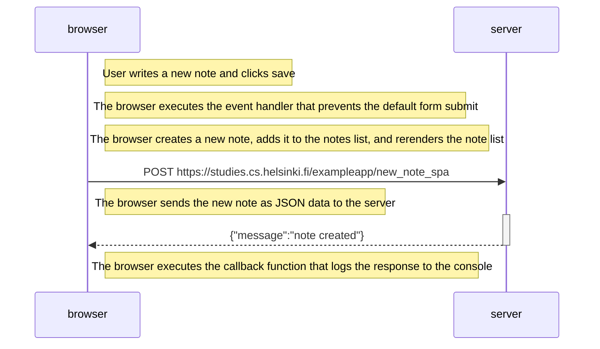

```mermaid

sequenceDiagram
    participant browser
    participant server

    Note right of browser: User writes a new note and clicks save
    Note right of browser: The browser executes the event handler that prevents the default form submit

    Note right of browser: The browser creates a new note, adds it to the notes list, and rerenders the note list

    browser->>server: POST https://studies.cs.helsinki.fi/exampleapp/new_note_spa
    Note right of browser: The browser sends the new note as JSON data to the server
    activate server
    server-->>browser: {"message":"note created"}
    deactivate server

    Note right of browser: The browser executes the callback function that logs the response to the console
```
